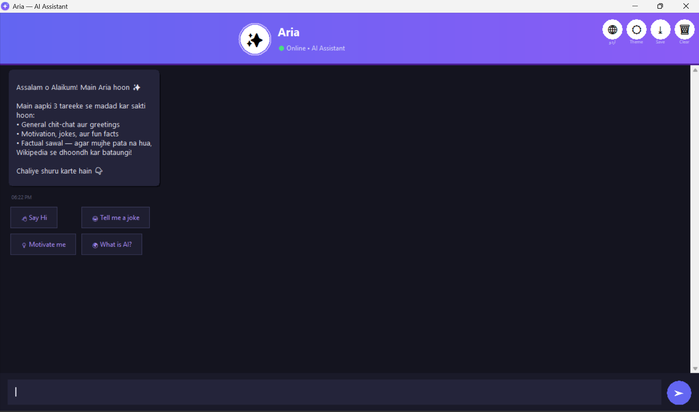
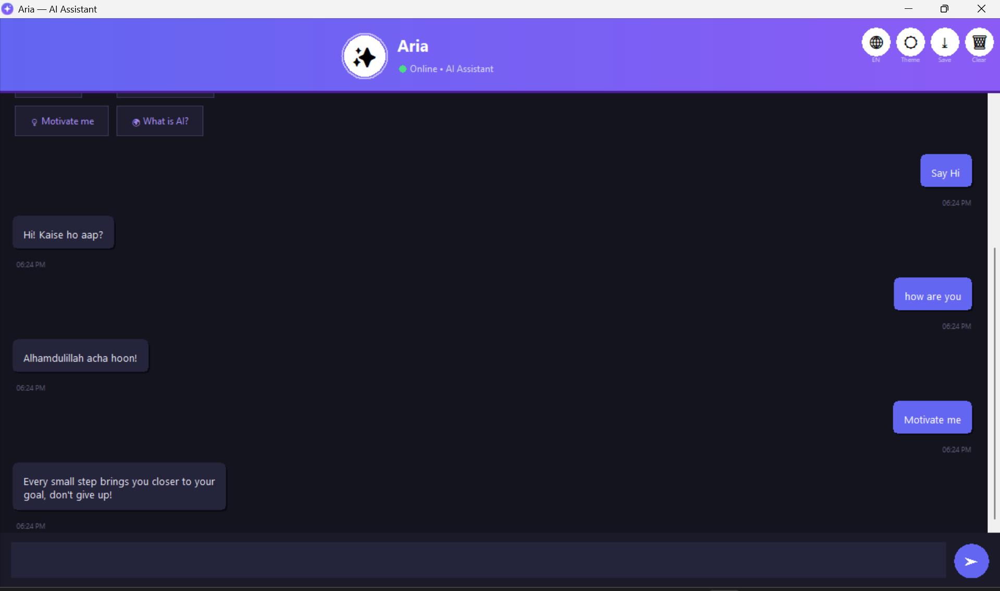
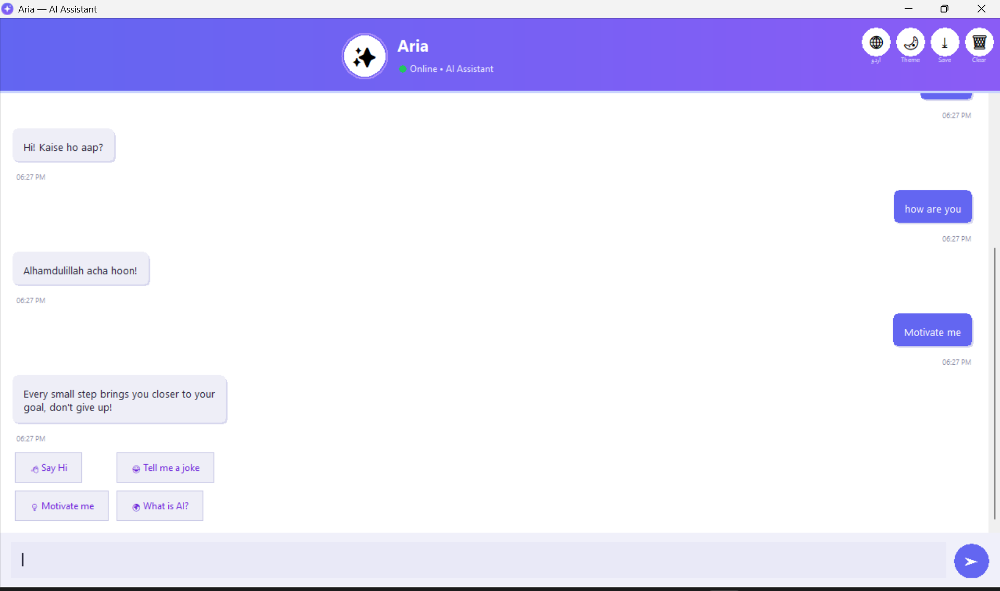
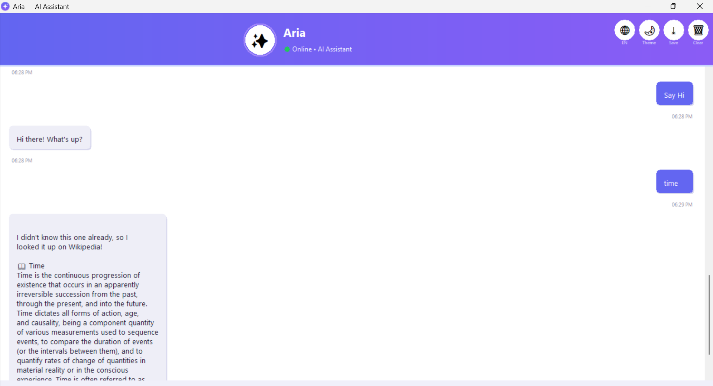

<!-- ✨ Aria — AI Rule-Based Assistant -->

"Aria" is a professional, GUI-based chatbot built in Python for the "InternGrow Python Programming Track" internship (Task 4: Intelligent Rule-Based Assistant). It combines a rule-based response engine (250+ hand-crafted, fully bilingual patterns) with a live "Wikipedia web-scraping fallback", wrapped in a polished, modern desktop interface.

> Upgrade Feature Implemented: Real-time Wikipedia summary scraping (via `requests` + `BeautifulSoup`) for any factual query outside the fixed response dataset.

<!-- 📸 Screenshots -->

| Welcome Screen (Dark) | Chat in Action | Light Theme | English Mode |
|:---:|:---:|:---:|:---:|
|  |  |  |  |

<!-- 🚀 Features -->

- 250+ Fully Bilingual Rule-Based Responses** across 12 categories (greetings, mood, jokes, motivation, tech basics, fun facts, and more) — every response exists in both Roman Urdu and English
- "Live Wikipedia Scraping Fallback" — resolves messy/misspelled queries via Wikipedia's OpenSearch API, then scrapes the article with BeautifulSoup for a clean, citation-free summary
- "🌐 Language Toggle" — switch the entire chatbot (fixed responses, system messages, error messages, dialogs) between Roman Urdu and English with one click
- "☀️ Dark / Light Theme Toggle" — instantly re-themes the entire chat history
- "Typing Animation" — bot replies render letter-by-letter for a natural conversational feel
- "⤓ Export Chat to .txt" — save your conversation anytime
- "🗑 Clear Chat" — reset the conversation with a confirmation prompt
- "🔊 Subtle Sound Effects" — audio feedback on send/receive (Windows)
- "Quick-Suggestion Chips" — one-click starter prompts
- "Custom Gradient App Icon" and a modern, centered indigo/violet themed interface
- "Threaded Network Calls" — Wikipedia lookups run in the background so the GUI never freezes

<!-- 🛠️ Tech Stack -->

- "Python 3" — core language
- "Tkinter" — GUI framework (Canvas-based rounded bubbles, gradient header, centered layout)
- "Requests" — HTTP calls to Wikipedia's OpenSearch API and article pages
- "BeautifulSoup4" — HTML parsing/scraping of Wikipedia article content
- "Threading" — non-blocking network calls
- "winsound" (built-in) — sound effects on Windows

<!-- 📂 Project Structure -->

InternGrow_ChatBot/
├── screenshots/          # README screenshots
├── chatbot.py             # Main GUI application (entry point)
├── qa_dataset.py           # 250+ bilingual rule-based Q&A patterns, organized by category
├── wiki_scraper.py          # Wikipedia OpenSearch + BeautifulSoup scraping logic
├── aria_icon.ico            # Custom app icon
├── requirements.txt
├── .gitignore
├── LICENSE
└── README.md

<!-- ⚙️ Installation & Usage -->

1. "Clone the repository"
   bash
   git clone https://github.com/mubashirjaved78/InternGrow_ChatBot.git
   cd InternGrow_ChatBot

2. "Install dependencies"
   bash
   pip install -r requirements.txt
   

3. "Run the application"
   bash
   python chatbot.py

<!-- 🧠 How It Works -->

User message
     │
     ▼
Check 250+ bilingual pattern dataset (qa_dataset.py)
     │
     ├── Match found  →  Return fixed response in selected language (Roman Urdu / English)
     │
     └── No match      →  Query Wikipedia (wiki_scraper.py)
                              │
                              ├── OpenSearch resolves correct article title
                              ├── BeautifulSoup scrapes & cleans the summary
                              └── Return live Wikipedia-sourced answer

Aria is intentionally scoped as a "rule-based + factual-lookup assistant" (per the internship's task requirements) rather than a general-purpose conversational AI — it excels at greetings, small talk, and factual/encyclopedic questions, and transparently tells the user when a query is outside its scope (e.g. creative writing requests).

<!-- 🎥 Demo Video -->

_Link to LinkedIn demo video will be added here._
"LinkedIn Link" ----- linkedin.com/in/mian-muhammad-mubashir-javed-13a23a419

<!-- 👤 Author -->

"Mubashir Javed"
BSAI Student, Emerson University Multan
YouTube: [Mubashir SkillForge]

Built as part of the "InternGrow Python Programming Track" internship.

<!-- 📄 License -->

This project is licensed under the [MIT License](LICENSE).
